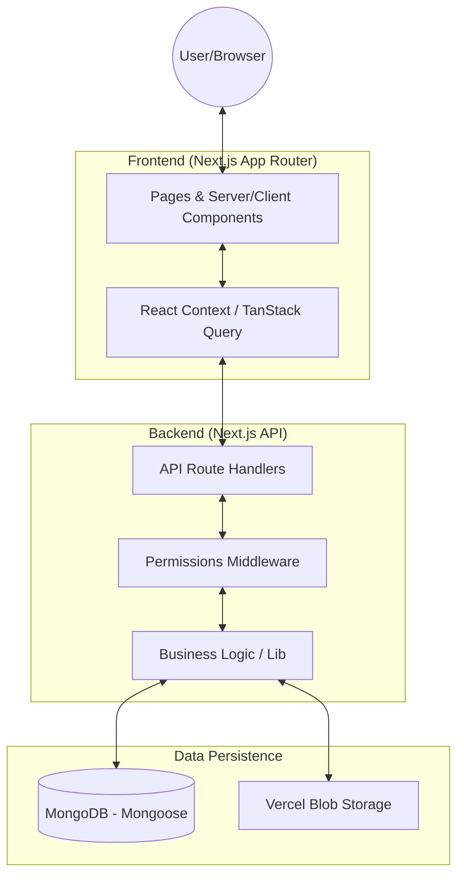

# System Architecture - Tanuki Admin

This document describes the high-level architecture, technical stack, and design patterns used in the Tanuki Admin project.

## 🏗️ High-Level Architecture

## 🛠️ Technology Stack

| Layer                | Technology                                                   |
| :------------------- | :----------------------------------------------------------- |
| **Framework**        | Next.js 16 (App Router)                                      |
| **Language**         | TypeScript                                                   |
| **Database**         | MongoDB with Mongoose ODM                                    |
| **Storage**          | Vercel Blob (Images/Assets)                                  |
| **State Management** | TanStack Query (Server State) + React Context (Client State) |
| **Styling**          | SASS (BEM) + Tailwind CSS                                    |
| **UI Components**    | Radix UI + Lucide React icons                                |
| **Validation**       | Zod (Schema validation)                                      |
| **Auth**             | Custom JWT-based implementation                              |

## 📁 Directory Structure & Responsibilities

- **`src/app/`**: routing and entry points. Contains both page components and API route handlers (`/api`).
- **`src/components/`**: UI components organized by domain.
  - `ui/`: Base primitive components.
  - `dashboard/`, `catalog/`, `inventory/`: Feature-specific components.
- **`src/lib/`**: Core utilities and shared service logic.
  - `mongodb.ts`: Database connection management.
  - `auth.ts` / `jwt.ts`: Authentication handling.
  - `permissions.ts`: RBAC (Role-Based Access Control) logic.
- **`src/models/`**: Mongoose schemas and model definitions.
- **`src/contexts/`**: Client-side state providers.
- **`src/styles/`**: Design system tokens and global styles using SASS.
- **`src/types/`**: Shared TypeScript interfaces and enums.

## 🔑 Key Architectural Patterns

### 1. Hybrid Styling System

The project is currently migrating from Tailwind CSS to a more robust **SASS + BEM** architecture. This provides better performance for complex components and a more maintainable design system while retaining Tailwind for quick layout iterations.

### 2. Role-Based Access Control (RBAC)

A granular permissions system is implemented to control access to both UI elements and API endpoints.

- **Frontend**: Components are conditionally rendered based on user permissions.
- **Backend**: API routes are protected by a centralized permission verification layer in `src/lib/apiPermissions.ts`.

### 3. Server-Client Boundary

The application clearly separates Server Components (for SEO and initial load performance) and Client Components (for interactive forms and complex state). API calls are handled via **TanStack Query** to manage caching, loading states, and synchronization with the database.

### 4. Data Integrity

- **Zod**: Used for strict validation of incoming requests and data transformations.
- **Mongoose**: Ensures structural integrity at the database layer with defined schemas and validation rules.

## 📦 Infrastructure & Deployment

- **Platform**: Optimized for Vercel.
- **Environment**: Configuration is strictly managed through environment variables (`.env`).
- **CI/CD Ready**: Project includes linting (ESLint, Stylelint) and testing (Jest, Cypress) configurations to ensure stability.
