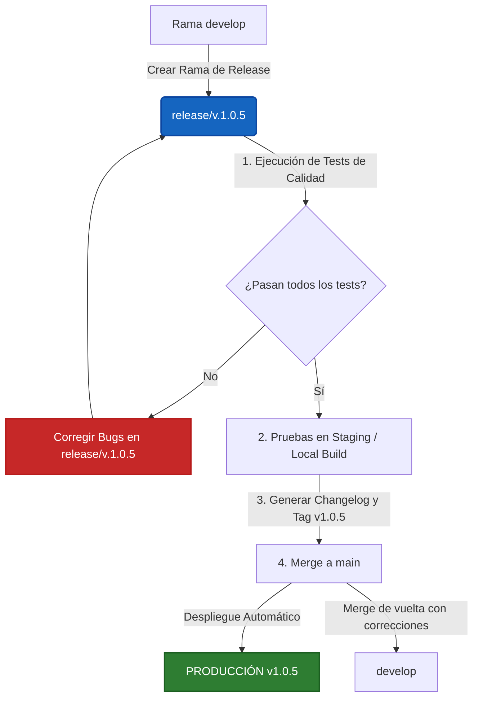

# Estándares de Producción y Checklist de Lanzamiento para Releases (v1.0.5+)

Este documento establece los estándares de calidad, rendimiento, adaptabilidad móvil, accesibilidad y base de datos requeridos para el paso a producción de cualquier entrega en **Tanuki Admin**. Estos lineamientos están basados en las mejores prácticas de la industria para aplicaciones modernas full-stack sobre **Next.js 16 (App Router)**, **React 19** y **MongoDB/Mongoose**.

---

## 📊 1. Estándares de Rendimiento y Adaptabilidad Móvil (Mobile-First)

Para garantizar una experiencia de usuario premium, fluida y estable, el release de la versión `v.1.0.5` (y posteriores) debe cumplir con los siguientes umbrales de rendimiento y adaptabilidad de diseño:

### A. Core Web Vitals (Frontend)

Medidos en entornos de pre-producción (Staging) o producción utilizando herramientas como **Lighthouse**, **Vercel Analytics** o **Sentry RUM**:

| Métrica                               | Definición                                            | Umbral de Aceptación (Bueno)    | Estado Crítico / Alerta |
| :------------------------------------ | :---------------------------------------------------- | :------------------------------ | :---------------------- |
| **LCP** _(Largest Contentful Paint)_  | Tiempo de carga del contenido visual principal.       | **≤ 2.5 segundos**              | > 4.0 segundos          |
| **INP** _(Interaction to Next Paint)_ | Latencia de interactividad (reemplaza a FID).         | **≤ 200 milisegundos**          | > 500 milisegundos      |
| **CLS** _(Cumulative Layout Shift)_   | Estabilidad visual (evitar saltos de diseño).         | **≤ 0.1**                       | > 0.25                  |
| **TTFB** _(Time to First Byte)_       | Tiempo de respuesta del servidor para el primer byte. | **≤ 600 milisegundos** (en SSR) | > 1.2 segundos          |

### B. Adaptabilidad Viewport y Mobile-First

El diseño de Tanuki Admin debe ser rigurosamente responsive, priorizando dispositivos móviles mediante un enfoque **Mobile-First**:

- **Prohibición de Desplazamiento Horizontal (Scroll Horizontal):**
  > [!IMPORTANT]
  > El scroll horizontal en anchos de pantalla menores o iguales a $1024\text{px}$ se considera un **error crítico de diseño** (Showstopper). Todo el contenido textual, tablas de datos, tarjetas y contenedores de formularios deben ajustarse o colapsar elegantemente de manera vertical.
  > _Excepción:_ Se permite scroll horizontal de forma localizada únicamente en gráficos interactivos o tablas de reporte anchas que utilicen un contenedor de desplazamiento explícito (`overflow-x: auto`) con indicadores visuales de arrastre.
- **Puntos de Quiebre (Breakpoints) a Verificar:**
  - **Mobile S (Pantallas pequeñas):** $320\text{px} \text{ a } 375\text{px}$ (ej. iPhone SE). El layout no debe romperse ni encabalgar elementos.
  - **Mobile M/L:** $375\text{px} \text{ a } 480\text{px}$ (ej. iPhone 14/15, Samsung Galaxy).
  - **Tablet:** $768\text{px} \text{ a } 1024\text{px}$ (ej. iPad Air/Pro).
  - **Desktop:** $1024\text{px}$ o superior.
- **Área de Toque Mínima (Touch Target Size - WCAG 2.5.8):**
  Cualquier elemento interactivo en móvil (botones, enlaces de pestañas, filas seleccionables, checkboxes) debe tener una dimensión mínima de **$44 \times 44\text{ CSS pixels}$** (o un mínimo físico de $24 \times 24\text{ px}$ con un espaciado circundante de al menos $8\text{ px}$) para evitar toques accidentales.
- **Gestos Alternativos (WCAG 2.5.1):** Cualquier funcionalidad que dependa de un gesto complejo (deslizar, pinzar) debe contar con un botón o mecanismo alternativo de un solo toque.

### C. Rendimiento de Compilación (Build & Bundle Size)

- **Tamaño de Página Inicial (First Load JS):** Ninguna página individual en el dashboard debe superar los **150 KB** en su bundle del cliente. Next.js marcará en rojo/amarillo las páginas que excedan este límite en la salida de `npm run build`.
  - _Solución:_ Utilizar carga diferida con `next/dynamic` para componentes pesados (ej. gráficos, modales complejos, visores de archivos).
- **Compresión de Recursos:** Mantener activa la compresión Gzip/Brotli a nivel de Next.js (`compress: true` en `next.config.ts`) y a nivel de CDN/Hosting.

---

## ♿ 2. Estándares de Accesibilidad (a11y - WCAG 2.1 AA)

Tanuki Admin es una herramienta de software empresarial, por lo que debe asegurar el cumplimiento de accesibilidad **Nivel AA** según las pautas de la WCAG 2.1. Esto garantiza que personas con diversas capacidades puedan operar el sistema de manera eficiente.

### A. Operabilidad con Teclado (WCAG 2.1.1)

- **Navegación Completa:** Absolutamente todos los elementos interactivos (botones de navegación, inputs de formularios, selectores de almacenes, filas interactivas) deben ser alcanzables y operables utilizando únicamente las teclas `Tab`, `Shift + Tab`, `Enter` y las flechas de dirección.
- **Indicador de Enfoque Visible (Focus Indicator - WCAG 2.4.7):**
  > [!IMPORTANT]
  > Al navegar con teclado, el elemento enfocado **debe tener un borde o contorno visual claro y de alto contraste**. Está prohibido remover el outline predeterminado del navegador (`outline: none`) sin proveer un estilo de reemplazo personalizado que sea claramente visible.
- **Orden de Foco Lógico (WCAG 2.4.3):** El flujo de navegación al presionar `Tab` debe seguir un orden secuencial lógico (de izquierda a derecha y de arriba a abajo), coincidiendo con el diseño visual del panel.

### B. Estructura Semántica y Lectores de Pantalla

- **Uso del Atributo `alt`:** Todas las imágenes o gráficos que contengan información crítica de negocio deben tener un atributo `alt` descriptivo. Los iconos meramente decorativos deben ocultarse de la tecnología de asistencia usando `aria-hidden="true"`.
- **Etiquetado Programático de Formularios:** Todo control de formulario (inputs de inventario, filtros de búsqueda, buscadores) debe estar asociado programáticamente a un `<label>` utilizando el atributo `htmlFor` o mediante la etiqueta `aria-label`/`aria-labelledby` para lectores de pantalla.
- **Estructura Jerárquica de Títulos (Headings):** Respetar la jerarquía semántica: un único `<h1>` por página, seguido de `<h2>`, `<h3>`, etc., sin saltarse niveles para fines de estilo.

### C. Contraste de Color y Zoom (Reflow)

- **Contraste Mínimo (WCAG 1.4.3):** El texto normal debe tener un ratio de contraste de al menos **4.5:1** contra el fondo. El texto grande (mayor a $18\text{pt}$ en negrita o $24\text{pt}$ normal) debe tener un ratio de al menos **3:1**.
- **Reflujo y Zoom de Pantalla al 400% (WCAG 1.4.10):** Al visualizar el sistema en una resolución de pantalla de $1280\text{px}$ y hacer zoom en el navegador al **400%**, el diseño debe refluir a una sola columna (comportándose como móvil a $320\text{px}$) sin solapamiento de textos ni pérdida de controles interactivos.

---

## 🗄️ 3. Estándares de Base de Datos (MongoDB & Mongoose)

Dado que Tanuki Admin procesa inventario, almacenes, movimientos históricos y centros de costo, la base de datos es el corazón de la aplicación. Se deben cumplir estos estándares antes del release:

### A. Análisis de Consultas y Cobertura de Índices

- **COLLSCAN (Collection Scan) = 0%:** Ninguna consulta frecuente (especialmente sobre colecciones grandes como `Movements` o `Products`) debe realizar un escaneo completo de la colección.
- **Uso de Índices (IXSCAN):** Todas las consultas de búsqueda, ordenamiento y agregación deben estar respaldadas por índices eficientes.
- **Query Targeting Ratio:** La relación entre documentos examinados y devueltos (`totalDocsExamined` / `nReturned`) debe ser cercana a **1:1** (tolerable hasta 5:1 en agregaciones complejas). Si es superior a **10:1**, la consulta es ineficiente y requiere optimización de índices.
- **Estrategia ESR (Equality, Sort, Range):** Al crear índices compuestos, el orden de los campos debe ser siempre:
  1.  **E**gualdad (`field: value`)
  2.  **S**ort (Ordenamiento)
  3.  **R**ange (Rangos: `$gt`, `$lt`, `$in`)

### B. Consultas Lentas (Slow Queries)

- **Umbral de Consulta Lenta (`slowms`):** **100 milisegundos**. Cualquier operación de base de datos que supere los 100 ms se considera una consulta lenta y debe ser optimizada en el entorno de desarrollo usando `explain("executionStats")`.
- **Pool de Conexiones:** Monitorear que la aplicación no exceda el límite del pool de conexiones (por defecto 100 en Mongoose). Las conexiones deben ser reutilizadas (Serverless caching si se despliega en entornos Edge/Serverless).

---

## 🛡️ 4. Estándares de Seguridad y Validación de Datos

- **Validación de Entradas (Zod Schemas):** Ningún payload del cliente (query params o body de la petición) debe procesarse directamente en el backend sin antes pasar por validación estricta con esquemas de `Zod` para evitar inyecciones u operaciones inválidas.
- **Seguridad en el Lado del Servidor (`server-only`):** Utilizar módulos o imports de servidor marcados explícitamente para asegurar que claves privadas de cifrado o credenciales de la base de datos no se filtren al bundle del cliente.
- **Variables de Envío Seguras:**
  - **Prohibido** usar el prefijo `NEXT_PUBLIC_` para cualquier variable que contenga tokens de API, contraseñas, URIs de conexión a BD (`MONGODB_URI`) o secretos de JWT.
  - Todas las variables de entorno de producción deben validarse en tiempo de inicio utilizando un script de validación de entornos o un esquema robusto en el código de inicialización.
- **Cabeceras HTTP de Seguridad:** Confirmar que la aplicación envía las cabeceras estándar de protección (HSTS, CSP, X-Frame-Options, X-Content-Type-Options, etc.). _Nota: Next.js ya tiene configuradas varias de estas cabeceras seguras en `next.config.ts`_.

---

## 🧪 5. Estándares de Calidad de Código y Testing

Antes de aprobar el paso a producción de la versión `v.1.0.5`, se deben ejecutar de forma satisfactoria los siguientes controles automáticos locales o de CI:

### A. Estáticas (Linters & Compilador)

- **TypeScript Estricto:** Ejecutar compilación completa para validar que no existan errores de tipos o variables implícitamente `any`.
- **Linter de JavaScript/TypeScript (ESLint):** No se permiten advertencias críticas ni errores de sintaxis o malas prácticas.
- **Linter de Estilos (Stylelint):** El proyecto cuenta con un proceso de migración de estilos SCSS a BEM. Toda hoja de estilos modificada en la versión `v.1.0.5` debe cumplir con las reglas especificadas en `.stylelintrc.json`.

### B. Pruebas Dinámicas (Tests)

- **Tests Unitarios (Jest):** La suite completa de pruebas unitarias debe pasar exitosamente (0 fallos).
- **Cobertura de Tests (Jest Coverage):** Se debe mantener una cobertura de código global de al menos **80%** en la lógica de negocio crítica (helpers, controladores de API de inventario, cálculos de balances y centros de costo).
- **Tests de Accesibilidad Automatizados (Cypress + Axe):** Ejecución de tests automatizados de accesibilidad con `axe-core` y `Cypress` para asegurar que el dashboard sea utilizable por personas con discapacidades (cumplimiento WCAG 2.1 AA).

---

## 🔄 6. Flujo del Pipeline de Release (Git & Deployment)

Para un control de versiones limpio y sin regresiones en producción, se adopta el siguiente flujo estructurado:



---

## 📝 7. Lista de Verificación (Checklist) de Pre-Lanzamiento para v1.0.5

Usa esta lista interactiva ejecutando los comandos locales disponibles en tu terminal antes de firmar el release:

### Paso 1: Limpieza, Formateo y Estilos SCSS BEM

Asegura que el código sea legible y que cumpla con los estándares de diseño.

- [ ] **Formatear el código con Prettier:**
  ```powershell
  npm run format
  ```
- [ ] **Analizar los estilos SCSS con Stylelint:**
      Asegura que los archivos SCSS nuevos o modificados (como `inventory-detail.scss` o `WarehouseMovementsTable.scss`) pasen la validación BEM.
  ```powershell
  npm run lint:css
  ```

### Paso 2: Análisis Estático de Código

- [ ] **Ejecutar ESLint:**
      Verifica que no haya advertencias o errores del linter de React/TypeScript.
  ```powershell
  npm run lint
  ```

### Paso 3: Pruebas de Adaptabilidad Móvil y Viewport (Pruebas Manuales)

Para asegurar que la aplicación cumple estrictamente con el enfoque **Mobile-First**:

- [ ] **Prueba de Scroll Horizontal (Showstopper):**
      Abre Chrome DevTools (`F12`), activa la vista móvil y define un ancho de viewport de **`320px`** (ej. iPhone SE). Desplázate verticalmente. Verifica que **ningún elemento** genere una barra de scroll horizontal en la parte inferior de la pantalla. Todo el contenido y las tarjetas deben envolverse fluidamente.
- [ ] **Prueba de Reflujo (Zoom 400%):**
      En un monitor con viewport de escritorio ($1280\text{px}$), haz zoom en el navegador presionando `Ctrl + Plus` hasta llegar a **400%**. Verifica que todo el contenido del panel se reordene automáticamente en una sola columna limpia, idéntico a una experiencia móvil de $320\text{px}$, sin solapamiento de textos ni pérdida de controles.
- [ ] **Prueba de Área de Toque (Touch Target Size):**
      Usando la herramienta de inspección en el simulador móvil, verifica que los botones de acción, iconos interactivos y pestañas de navegación tengan un espacio físico interactivo mínimo de **`44px x 44px`** o un margen suficiente que prevenga toques accidentales con el dedo.
- [ ] **Prueba de Orientación Móvil:**
      Verifica en un dispositivo real o emulador que la aplicación funcione tanto en posición vertical (Portrait) como horizontal (Landscape) sin desconfigurar el diseño.

### Paso 4: Pruebas de Accesibilidad (a11y)

Combina pruebas manuales y scripts automáticos para asegurar que nadie quede excluido del uso del sistema:

- [ ] **Ejecutar pruebas de accesibilidad automatizadas (Cypress + Axe-core):**
      Este comando ejecuta un script que descubre todas las rutas registradas y corre pruebas de accesibilidad automatizadas en cada una de ellas empleando `cypress-axe`.
  ```powershell
  npm run test:a11y
  ```
- [ ] **Prueba de Navegación por Teclado (Foco e Indicador):**
      Desconecta el ratón/mouse y navega por el panel utilizando la tecla `Tab`. Verifica que:
  - El flujo del foco siga una secuencia lógica y natural.
  - El elemento enfocado actualmente sea **claramente visible** gracias a un contorno de contraste de alta visibilidad (prohibido que el foco sea invisible).
  - Se pueda abrir, seleccionar y cerrar cualquier modal o dropdown usando solamente `Tab`, `Arrows`, `Space` y `Enter`.
- [ ] **Prueba de Relación de Contraste:**
      Utiliza herramientas como _axe DevTools_ o el selector de color de Chrome DevTools para garantizar que todos los textos modificados en la v1.0.5 tengan un ratio de contraste mínimo de **4.5:1** (o 3:1 para textos muy grandes).
- [ ] **Prueba de Lector de Pantalla en Dispositivo Real (Recomendado):**
      Activa _VoiceOver_ en un iPhone/iPad o _TalkBack_ en un dispositivo Android. Navega por las pantallas clave modificadas de la v1.0.5 (como el detalle de inventario o la tabla de movimientos de almacén) y comprueba que el lector de pantalla anuncie correctamente la información crítica de las tablas y los controles de formulario.

### Paso 5: Pruebas Unitarias de Regresión

- [ ] **Ejecutar la suite de pruebas unitarias (Jest):**
      Asegura que no haya regresiones en cálculos lógicos ni en lógica de negocio.
  ```powershell
  npm run test
  ```
- [ ] **Revisar cobertura de código (Opcional pero Recomendado):**
  ```powershell
  npm run test:coverage
  ```

### Paso 6: Rendimiento y Verificación de Índices en BD

- [ ] **Validar y optimizar Índices de MongoDB:**
      Tanuki Admin cuenta con scripts para validar que los índices necesarios estén en su lugar y para medir el rendimiento de las consultas.

  ```powershell
  # Verifica que los índices necesarios en MongoDB existan y estén activos
  npm run db:check-indexes

  # Corre un benchmark de las consultas más comunes para asegurar que no haya COLLSCAN
  npm run db:benchmark
  ```

### Paso 7: Construcción de Producción y Análisis de Bundles

- [ ] **Ejecutar la compilación de producción de Next.js:**
      Este comando verificará la rigurosidad de los tipos de TypeScript y te mostrará el tamaño exacto del bundle de cada página. No debe haber ningún error de compilación.
  ```powershell
  npm run build
  ```
- [ ] **Auditar el rendimiento local con Lighthouse (Opcional):**
      Puedes compilar la aplicación, iniciar el servidor en modo producción y auditar el rendimiento y Web Vitals.
  ```powershell
  npm run perf
  ```

### Paso 8: Configuración del Entorno e Infraestructura

- [ ] **Validación de variables de entorno de producción:**
      Asegurar que todas las variables del `.env` de producción estén correctamente seteadas en el proveedor de hosting y que ninguna variable privada tenga el prefijo `NEXT_PUBLIC_`.
- [ ] **Verificación de dependencias vulnerables:**
      Asegurar que no existan vulnerabilidades críticas conocidas en las librerías del proyecto.
  ```powershell
  npm audit
  ```

### Paso 9: Gestión de Versión, Changelog y Merge

- [ ] **Actualizar el Changelog oficial:**
      Documentar los cambios de la versión `1.0.5` en el archivo `docs/CHANGELOG.md` (y/o crear el archivo de release correspondiente bajo la convención del proyecto).
- [ ] **Tagging en Git:**
      Crear el tag de la versión `v1.0.5` una vez se haga merge a `main`:
  ```bash
  git checkout main
  git merge release/v.1.0.5
  git tag -a v1.0.5 -m "Release version 1.0.5"
  git push origin main --tags
  ```

---

> [!IMPORTANT]
> **Bloqueadores de Release (Showstoppers):**
> Un release de producción **no debe proceder** si:
>
> 1. El script `npm run build` falla (errores de TypeScript o problemas de bundling).
> 2. Hay fallas activas en `npm run test` (regresiones lógicas).
> 3. Se detectan consultas que realizan `COLLSCAN` en colecciones que superan los 10,000 registros en el benchmark de BD (`npm run db:benchmark`).
> 4. Se detectan claves privadas expuestas con prefijo `NEXT_PUBLIC_`.
> 5. **[MÓVIL]** Existe desplazamiento horizontal (scroll horizontal) en el layout principal a un ancho de **`320px`** de viewport.
> 6. **[a11y]** Al navegar con teclado (`Tab`), el foco de selección se vuelve invisible (falta de indicador visual visible) o entra en un bucle infinito que impide avanzar o retroceder.
